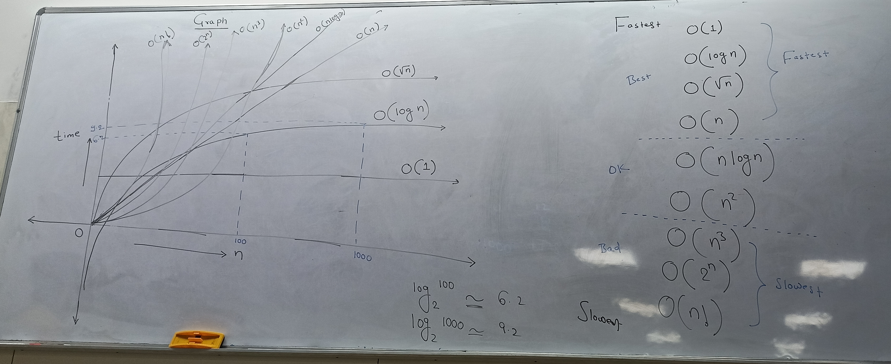

# Algorithm :
Algorithm is a step by step process to solve any problem

### Algorithm analysis
 Algorithm analysis is a measurment to find out how much time or space will be required to solve the problem using the given alogorithm.
Can algorithm is analysed by using three factors
1. Big Omega(`Ω`)
    - Lower bound (BEST CASE)
    - Problem can be solved in the given minimum time(In less than this problem cant be solved)
2. Big theta(`Θ`)
    - Average bound (AVERAGE CASE)
    - Problem can be typically solved in the given time (Problem may take less or more time to solve)
3. OrderOf( `O` )
    - Upper bound (WORST TIME)
    - Problem will never take more than this time to solve (Problem may be solved in more time)

#### Swap two number

```java
swap(a,b)
temp = a;
a = b;
b - temp;
```
`O(time) = O(1)`

If there is a 20 or 200 statament but they are fixed then we can say same thing as `O(time) = O(1)`

#### Add n natural numbers

```java
add(n);
sum = 0;
for(int i=0; i<=n; i++)
   sum += i;
```
`O(time) = O(n)`

<br><br><br><br><br>

#### Alogo - 3

```java
// stmt -1
for(int i=0; i <= n; i++){
  // stmt - 2
}
// stmt - 3
for(int i=0; i <= 2n; i++){
  // stmt - 4
  // stmt - 5
}
for(int i=0; i <= 2n; i++){
  // stmt - 6
}
```

`O(time) = O(5n+2)  => o(n)`

- Variable having biggest power is to be considered.
- All constants ignored

---

#### Algo - 4

```java
for(int i=0; i <= n; i++){
  for(int j=0; j <= n; j++){
  // stmt - 1
}
}
```
`O(time) = O(n^2)`

---

#### Algo - 5

```java
// stmt - 1
for(int i=1; i <= n; i++){
  // stmt - 2
  for(int j=1; j <= n; j++){
  // stmt - 3
  // stmt - 4
}
  for(int j=1; j <= n; j++){
  // stmt - 5
}
}
```

```
O(time)  = O(n*(3n+1))
         = O(3n^2 + n)
         = O(n^2)
```
---


#### Alogo - 6

```java
for(int k = 1; k <= n;k++){
  for(int i=0; i <= n; i++){
    // stmt - 1
  }
  // stmt - 2
  for(int i=0; i <= 2n; i++){
    // stmt - 3
    // stmt - 4
  }
}
  for(int i=0; i <= 2n; i++){
    // stmt - 5
  }
//stmt - 6
```

```
O(time) = O(n*(3n+1) 2n) => O(3n^2 + 2n + 1)
                         => O(n^2)
```

---

#### Algo - 7

```java
for(int i=0; i <= n; i++){
  for(int j=0; j <= n; j++){
    for(int j=0; j <= n; j++){
       // stmt - 1
     }
   }
}
```

`O(time) = O(n^3)`

***This is worst Dont use this***

---

```js
O(3n)             =>  O(n)
O(3n + 8)         =>  O(n)
O(n^2 + 8)        =>  O(n^2)
O(3n^2 + 8n + 3)  =>  O(n^2)
```

**Complexity**

```js
O(1) < O(n) < O(n^2) < O(n^3)
```

`O(1)` :  Least time

`O(n^3)` : Worst time


`O(1) > O(log n) > O(root n) >  O(n) > O(nlog) > O(n^2) > O(n^3) > O(2^n) > O(n!)`

***BEST/FASTEST***: O(1) > O(log n) > O(root n) >  O(n)
***OK***: O(nlog) > O(n^2)
***BAD***: O(n^3) > O(2^n) > O(n!)


