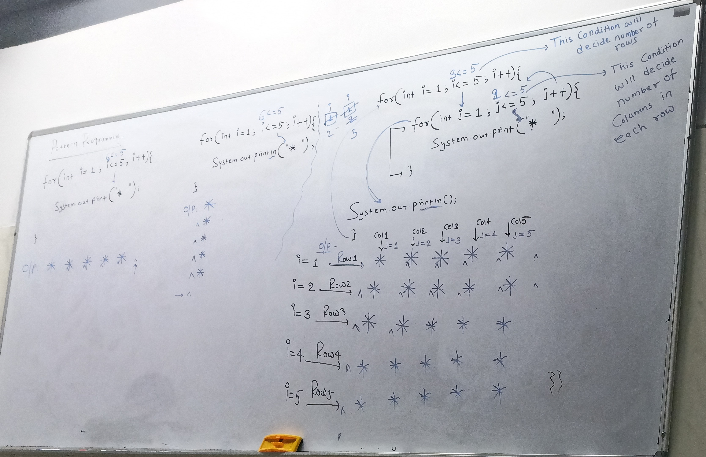

## Pattern Programming Notes

- Inner loop deside the how many columns
- Outer loop deside the how many rows

- If in the row having same value then thats directly connected with outer loop.
- If the value change in the row then this is handled by the inner loop.

### Note

**1.** If values are same in row then think about `i`(outer loop) to generate the pattern.

```css
11111
22222
33333
44444
55555
```

**Here in the row having same value so main role played by the outer loop**

- System.outprint(i+" ");

**2.** if values are same in each column then think of `j`(inner loop) to print it.

````css
12345
12345
12345
12345
12345
```s

**Here in the column having same value so main role played by the inner loop**

- System.out.print(j+" ");




---

### 1. Format where space is not required

```java
    public static void printPattern(int n){
        int star = ;
        for(int i = 1; i <= n; i++){
            for(int j = 1; j <= star; j++){
                System.out.print("* ");
            }

            System.out.println();
        }
    }
````

### 2. Format where space and star are required

- First loop will change the row
- middle loop will print space.
- inner loop print star

```java
    public static void printPattern(int n){
        int star = ;
        int space = ;

        for(int i = 1; i <= n; i++){

            for(int j = 1; j <= space; j++){

                System.out.print("  ");

               for(int j = 1; j <= star; j++){
                   System.out.print("* ");
               }
            }
            System.out.println();
        }
    }
```

- First check How many star in the first row and consider **star** = How many star in the first row.
