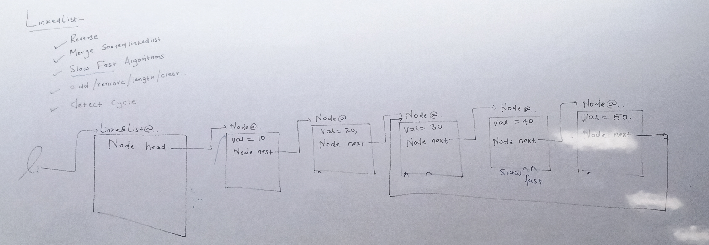
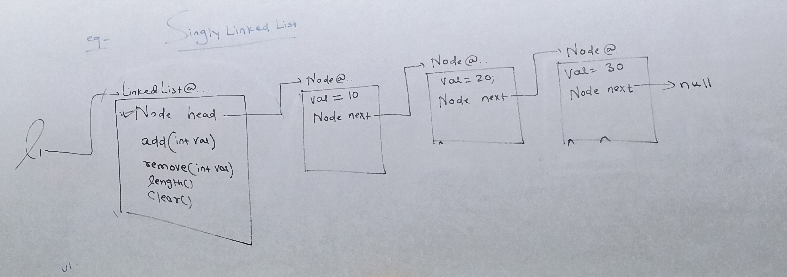
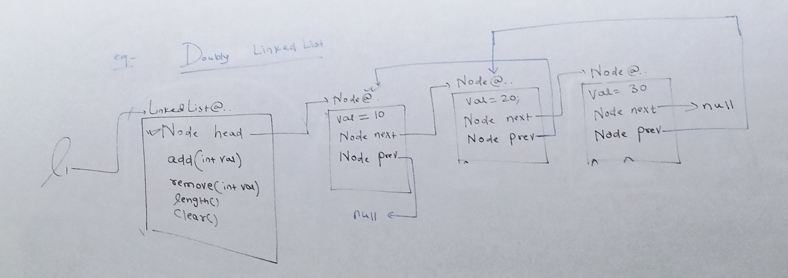
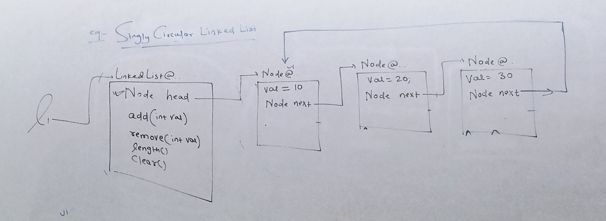
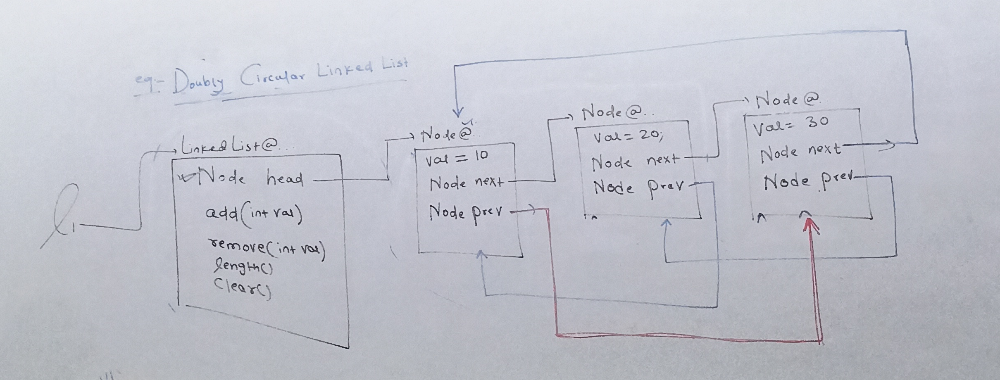
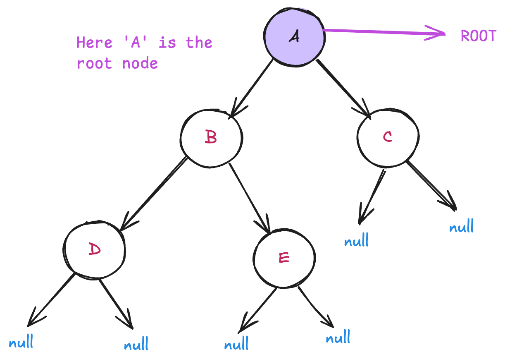
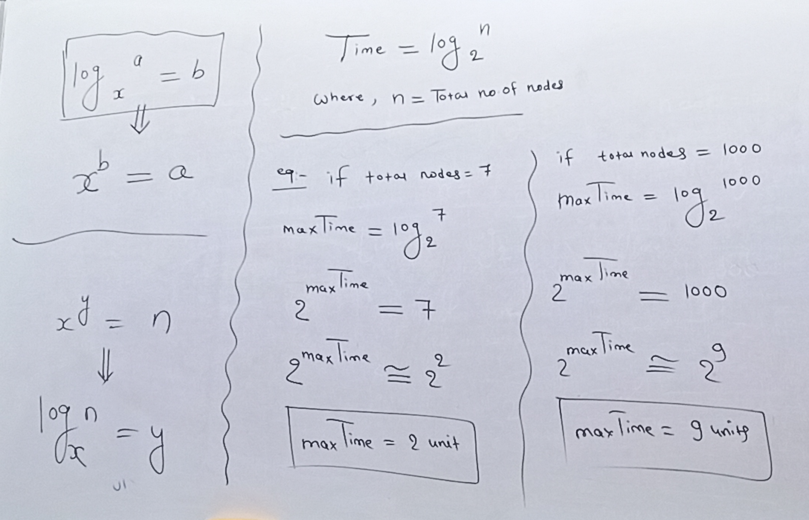

# Data Structure

Data structure is the representation of data which helps to add, insert, remove, sort, or search data in the most efficient manner.

## Types of Data Structures

### 1. Linear Data Structure

When a group of data is stored in a linear manner or in sequential manner, then it is called linear data structure.

**Examples:** Array, LinkedList, Stack, Queue, etc.

### 2. Non-linear Data Structure

When a group of data is stored not sequentially and stored in hierarchical or in network-like structure.

**Examples:** Tree (Hierarchical), Graph (Network-like structure), Heap, Trie

---

## Abstract Data Type (ADT)

If data is created in such a manner that we have data, data values, and there are various methods to work on the data, then it is called abstract data type.

---

    

## LinkedList

- It is a linear data structure
- Data stored in the form of nodes in a sequential manner

### Advantages

- It provides insertion or deletion operations very fast
- We can add or insert elements in O(1) constant time

### Types of LinkedList

#### 1. Singly LinkedList

- If the node used in linkedlist contains node value and reference for the next node, then it is called singly linked list
- In singly list, we can traverse only forward; we can't go backward

    

#### 2. Doubly LinkedList

- If the node of linkedlist contains node value along with reference for next and previous node, then it is called doubly linkedlist

#### 3. Singly Circular LinkedList

- If singly linked list is designed in such a manner that its last node is not pointing to null but is pointing to the first node of linkedlist, then it is called singly circular linked list

#### 4. Doubly Circular LinkedList

- If doubly linked list is designed in such a manner that the last node's next pointer is pointing to the first node and the first node's previous pointer is pointing to the last node, then it is called doubly circular linked list

---

## Tree Data Structure

Tree is a non-linear or hierarchical data structure where a node will have node value and reference for its child nodes.

  

### Binary Tree

If the node of a tree is designed in such a manner that it can have maximum 2 children or no child, then it is called binary tree.

### Tree Terminology

#### 1. Root Node

- The topmost node of a tree is called root node
- Every tree will have exactly one root node

#### 2. Parent Node

- If a node has at least one child, then it is called parent node
- Example: `A` is parent of `B` and `C`, and `B` is parent of `D` and `E`

#### 3. Child Node

- A node that comes from a parent is called child node
- Example: `B` and `C` are child nodes of `A`

#### 4. Leaf Node

- If a node does not have any child node, then it is called leaf node
- Example: `D`, `E`, and `C` are leaf nodes

#### 5. Sibling Nodes

- If nodes have the same parent, those are called siblings
- Example: `B` and `C` are siblings from `A`, and `D` and `E` are siblings from `B`

#### 6. Edge

- Connecting points between two nodes are called edges

#### 7. Path

- The shortest link between two nodes is called path

Example: Path from `D` to `C`

`D --> B --> A --> C`

#### 8. Path Length

- The number of edges used between two nodes is called path length

Example: Path length of `D` to `C` is 3

#### 9. Depth

- The shortest distance of a node from root node is called depth

Example: Depth of:

- A: 0
- B, C: 1
- D, E: 2

#### 10. Height

- Height of a node is the shortest distance of a node from leaf node

Example:

- Height of D, E, C: 0
- Height of B: 1
- Height of A: 2

#### 11. Level

- Depth + 1 is called level of node

#### 12. Total Number of Nodes

Total number of nodes in a tree full up to level `n`:

**Formula:** Total Nodes = `2^n - 1`

Where `n` = number of levels

**Total Edges** = `Total Nodes - 1`

#### 13. Maximum Traversal Time

Maximum time in a tree containing n nodes to traverse from root to any leaf or from any leaf to root node.

