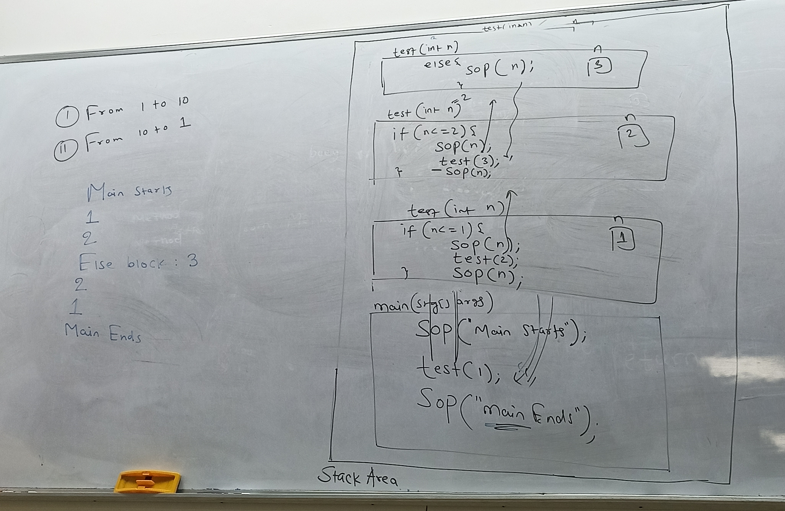
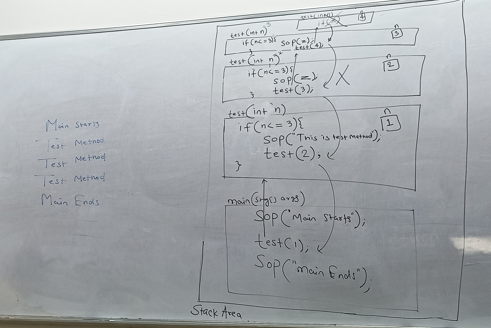

## Recursion
Recursion is a mechanaism where a method calls itself.
When a method calls itself then it starts executing again and again repeatedly and this process is called recursion.
If it is not controlled then it will give an error called `stackOverFlowError` error
It must be controlled by using flow control statement.
We can achieve recursion in 3 ways.

1. By calling Method from inside body.

```java
public static void test(){
  test();
}
```

2. By calling method from method call
```java
public static void test(){}

test();
```

3. By calling method from return statement
```java
public static void test(){
  return test();
}
```


### 1. Recursion by calling by inside method body

when a method is called from inside method body then it will executing repeatedly and if it is not controlled then it will give exception `stackOverFlow`. We can control it using flow control statement

### Questions

1. Print numbers from 1 to 10





2. Print numbers from 10 to 1 withot using loop


### 2. Recursion from method call as an argument

A method can be called from its argument which will form repeated execution which is called execution.

```java
class Program{
  public static void main(String[] ar){
    int n1 = 10, n2 = 20, n3 = 30, n4 = 40, n5 = 50,
    n6 = 60, n7 = 70, n8 = 80, n9 = 90, n10 = 100,
    n11 = 110;

    int sum1 = add(n1, n2);

    int sum2 = add(add(n3,n4),n5);

    int sum3 = add(add(add(n6,n7), add(n8,n9)), add(n10, n11));

    System.out.println("Sum - 1 : "+sum1);
    System.out.println("Sum - 2 : "+sum2);
    System.out.println("Sum - 3 : "+sum3);

  }

  public static int add(int a, int b){
    return a+b;
  }
}
```

***Question : Find the Biggest number among four numbers.***


### 3. Recursion from return Statement


